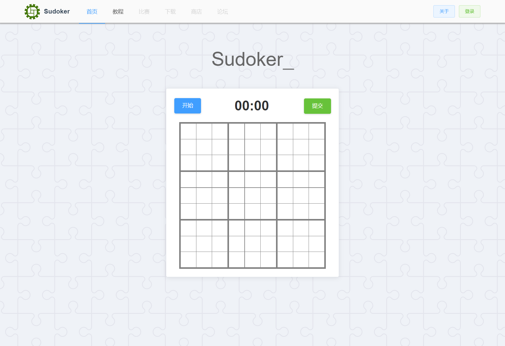
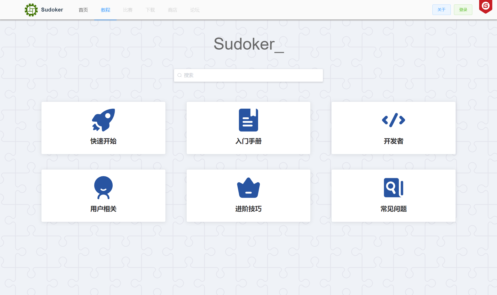

# Sudoker-数独客
 <br/>
<div align='center'></div>

### 介绍

---

😄 数独客，致力于构建国内一流的开源在线智力游戏平台，成立属于国人的数独社区。同时对外输出 API 服务、前端组件等开放能力。积极接受社区贡献。（本仓库为前端）<br/><br/>
**后端仓库** : [Sudoker 后端](https://gitee.com/carlos_li/sudoker-be)

**官网**：[sudoker.cn](http://sudoker.cn)

<br/>

#### 当前界面

---

##### 首页




##### 教程页



<br/>

#### 安装教程

---

##### 二进制安装

（项目启动阶段，尚无二进制产物）

##### 源码安装

1. 拉取代码

   ```shell
   git clone https://gitee.com/carlos_li/new-sudoker-fe.git
   ```

2. 安装依赖

   ```shell
   npm install
   ```

3. 开发模式启动

   ```shell
   npm run serve
   ```

4. 生产环境打包

   ```shell
   npm run build
   ```
<br/>

#### 社区

---

**Sudoker** 社区诚招热爱技术的小伙伴！<br/>
邮件列表：sudoker@groups.163.com<br/>
QQ 群：296945786<br/>

<br/>

### 参与贡献

---

本项目由社区驱动，当前核心开发者为2人，积极接受社区贡献。包括但不限于：
-  :fa-code: 代码 （作者 **定期审核** PR）
-  :pencil: 翻译 （ 诚招 **README** 文件或其他文档的翻译大佬 ~）
-  :tw-1f528: Issue / 问题 （提 **bug和建议** 的样子最帅了~）
-  :rocket: 推广 （一起 **双向推广** 鸭 ~）